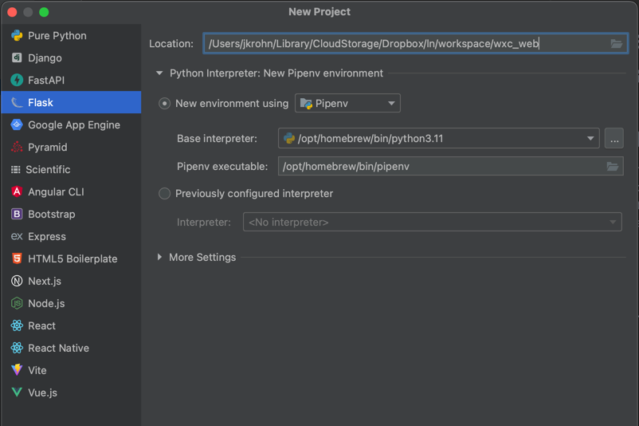

# Web app to enable config access for users

... work in progress

## Concept

* based on Flask
* bootstrap
* free bootstrap theme
* run as service app

## Steps
### create Python project w/ Flask support

### Free bootstrap template

Free admin template: https://startbootstrap.com/template/sb-admin

### Download/install Bootstrap

### Download/install admin template

### build main web site

### Login via Webex

https://developer.webex.com/docs/login-with-webex

